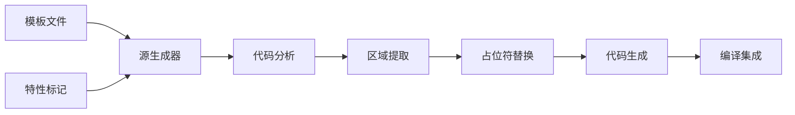

# CodeInject 项目简介

## 🎯 项目概述

**CodeInject** 是一个专为 .NET 开发者设计的源生成器（Source Generator），它能够在编译时自动将模板文件中的代码区域注入到部分类中。这个工具的核心理念是通过模板化的方式减少重复代码，提高开发效率。

## 🚀 诞生背景

在现代软件开发中，我们经常面临以下挑战：

- **代码重复**：CRUD 操作、API 控制器、仓储模式等场景下，存在大量相似的样板代码
- **维护困难**：手动编写的重复代码难以统一修改和维护
- **一致性问题**：团队成员编写的类似功能代码风格不统一
- **效率低下**：重复编写相同模式的代码浪费大量时间

CodeInject 正是为了解决这些问题而诞生的。

## 🏗️ 技术架构

### 核心组件

1. **源生成器引擎** (`CodeInjectIncrementalSourceGenerator`)
   - 基于 Roslyn 分析器
   - 实现增量生成，提高编译性能
   - 支持 .NET Standard 2.0，兼容性好

2. **特性系统** (`RegionInjectAttribute`)
   - 声明式配置
   - 支持多重应用
   - 灵活的占位符机制

3. **模板引擎**
   - 基于 C# `#region` 语法
   - 支持嵌套区域
   - 智能缩进处理

4. **占位符处理器**
   - 支持 `{placeholder}` 和 `placeholder` 两种格式
   - 键值对替换机制
   - 灵活的参数传递

### 工作流程



## 💡 核心特性

### 1. 模板驱动开发
- 将通用代码模式抽象为模板
- 通过 `#region` 标记定义可重用代码块
- 支持复杂的嵌套结构

### 2. 编译时生成
- 零运行时开销
- 生成的代码可调试、可查看
- 与现有 IDE 工具完美集成

### 3. 增量编译支持
- 只在模板或特性变化时重新生成
- 大幅提升编译速度
- 优化大型项目的构建时间

### 4. 强类型安全
- 生成的代码遵循 C# 语法规则
- 编译时错误检查
- IntelliSense 支持

## 🎯 应用场景

### 1. API 开发
```csharp
// 一次定义，多处使用
[RegionInject("Templates/ApiController.cs", "CrudActions", 
    "Entity", "User")]
public partial class UserController : ControllerBase
{
    // 自动生成 CRUD 操作方法
}
```

### 2. 数据访问层
```csharp
// 统一的仓储模式
[RegionInject("Templates/Repository.cs", "DataMethods", 
    "EntityType", "Product")]
public partial class ProductRepository
{
    // 自动生成数据操作方法
}
```

### 3. 业务逻辑层
```csharp
// 标准化业务操作
[RegionInject("Templates/Service.cs", "BusinessMethods", 
    "DomainModel", "Order")]
public partial class OrderService
{
    // 自动生成业务逻辑方法
}
```

## 🎉 核心优势

### 开发效率提升
- **90%+ 代码减少**：常见 CRUD 操作无需手动编写
- **秒级生成**：编译时自动生成，无需额外工具
- **一致性保证**：基于模板确保代码风格统一

### 维护成本降低
- **集中化管理**：模板修改即可影响所有使用处
- **版本控制友好**：模板文件可独立管理和版本化
- **重构安全**：生成的代码与手写代码无差异

### 团队协作增强
- **标准化流程**：团队共享模板库
- **知识沉淀**：最佳实践以模板形式保存
- **新人友好**：快速上手，遵循既定模式

## 🌟 创新点

1. **声明式开发模式**
   - 通过特性声明需要的代码
   - 专注于业务逻辑而非重复代码

2. **模板即代码**
   - 模板文件就是标准 C# 代码
   - 无需学习新的模板语法

3. **智能占位符系统**
   - 支持多种占位符格式
   - 灵活的参数传递机制

4. **零配置使用**
   - 添加 NuGet 包即可使用
   - 无需复杂的项目配置

## 📈 性能特点

- **编译时开销**：< 100ms（中等项目）
- **运行时开销**：0（完全编译时生成）
- **内存占用**：与手写代码相同
- **构建时间**：通过增量生成显著优化

## 🔮 未来发展

### 短期目标（1-3个月）
- 支持更多模板格式（JSON、XML）
- 增强 IDE 集成体验
- 扩展诊断信息

### 中期目标（3-6个月）
- 模板市场和共享机制
- 可视化模板设计器
- 性能进一步优化

### 长期愿景（6个月+）
- 跨语言模板支持
- 云端模板服务
- AI 辅助模板生成

## 🤝 社区价值

CodeInject 不仅是一个工具，更是一种开发理念的实践：

- **开源精神**：完全开源，欢迎社区贡献
- **知识共享**：模板库促进最佳实践传播
- **生态建设**：为 .NET 社区提供新的开发模式

---

CodeInject 代表了一种新的代码生成思路，它让开发者能够在保持代码质量的同时，大幅提升开发效率。这个项目的目标不仅是解决当前的开发痛点，更是为 .NET 生态系统注入新的活力。